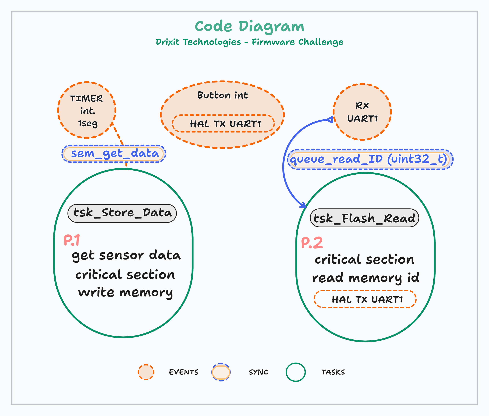

# Drixit Technologies - Firmware Challenge 
>>**Rev 01** Date: 09/04/2024

The firmware in this repository was made for the requirements you can find in the following [LINK](./Instructions/Firmware%20Engineer%20-%20Ejercicio.pdf)

***
It was requested to create the corresponding drivers for a flash memory and a magnetic sensor.
Based on the [Datasheets](./Datasheets) basic versions of the required drivers were developed.
***
## Considerations
Since both devices had SPI communication bus, the solution was made considering both of them connected in this bus, and the corresponding ports for selection. 

For the button, it was assumed that debounce and noise suppression were developed in hardware.

For **uC** a STM32F103C8 was selected and the ports configured as the following image:

The Real Time Operative Sistem that was selected was FreeRTOS Kernel V10.5.1.

The Firmware was compiled in STM32CubeIDE Version: 1.6.1 Build: 9958_20210326_1446 (UTC).
****
## Drivers

### LIS3MDL
The initialization, register writing, configuration and data reading functions were developed.
The initialization function (**LIS3MDL_init**) takes as parameters the SPI handler as well as the port and pin to select the device.

* The configuration function (**LIS3MDL_config**) was done by writing registers with the required characteristics, however, it was thought that it could be configured, in the future, with parameters of the function. 

* The register writing function (**LIS3MDL_Write_Reg**) was implemented to abstract this task from the other functions and to make the code easier to read.

* The function of reading data (**LIS3MDL_Get_XYZT**) reads the corresponding registers and also the temperature of the sensor, information required by the instruction.

### W25Q80

The initialization, read and write data functions have been developed. In addition, the device 
needed a function both before and after the write/erase to disable it. 
Also a function to check if it was busy and a full flash erase function were included. 

* The initialization function (**W25Q_Init**) takes as parameters the SPI handler as well as the port and pin to select the device.

* The data read function (**W25Q_Read_data**) takes as parameters the pointer to the variable to store the data, the memory address to read and the data size (in bytes) to read.
It transmits the command to perform the "FAST READ" and the memory address (sending its most significant byte first) appending a dummy byte after the address (to perform a Fast Read).
The Fast Read command is used to operate at maximum frequency.

* The data write function (**W25Q_Write_data**) receives as parameters the pointer to the variable where the data is, the memory address to be write and the data size in bytes.
    * From the address we get the page and the address within the page. Since we can store a maximum of one page, we have to iterate if we want to write more than 256 bytes. So we loop as many times as we need to write (pages to complete).
        * The address of each iteration is "Dir Base + Offset + ITERATION".
        * The remaining bytes are appended by looping a data train.
        * And the data train (remaining bytes) of each page are written in a single operation. 
        * At the end of each page that was written, the offset is reset and the remaining bytes to be written to the Flash are decremented.
 
* The Write Enable function (**W25Q80_Set_Write_State**) receives a "1"/"0" ("Enabled/Disabled") state to configure the integrated device accordingly.

* The write standby function (**W25Q80_Is_Busy**) blocks the process until the corresponding register does not change state.

* Datasheet flash memory configurations:*
  
    * ***8.2** Command Table Page 18*
    
    * ***8.5.7** Fast Read (0x0Bh) Page 26*

****
## Main Firmware

The tasks are implemented by priority and it was defined to use two of them:
* The task 'tsk_Flash_Read'
  
  *Task to read the ids stored on the flash card and send them via UART.*

* The task 'tsk_Store_Data'
  
  *Task to receive data and store it to the flash memory.*
###  Event Synchronization
* A semaphore is used to release the task that gets the sensor data, this semaphore is released by an interrupt routine every second.
* A queue is used to send the ID required by the uart to the corresponding task reading from the flash memory.
  

***
#### Reading of the flash memory
By UART is received the ID of an entry to be read. 
If it is within the range of valid IDs, and is stored in flash memory, is sent with the data of the flash memory read task.
If the ID is not in the range of valid IDs and is stored in the flash memory, the ID is sent with the data from the sensor.
If it is not in the range of valid IDs, it is analyzed to see if it corresponds to a complete erasure of the memory.
If not, the corresponding error is reported in both cases.

When the external interruption is performed (by the user clicking a button), the last data stored is sent. The requirement was to send it immediately so the last data is stored in a global variable and sent.

***
#### Writing the flash memory
For the flash memory, the index of the last stored data is stored in the first position.
And the first page (256byte) remains available for future configurations (firmware version, configurations...).

Data structures of 12byte are stored aligned to 16byte for faster operations. This implys the loss of 4 bytes (per structure) in memory but helps standard writes to each page, leaving 16 data structures per page. 
In this way, 65280 structures can be stored, leaving 18 hours of useful memory.

#### Auxiliary function

There are helper functions implemented to translate memory address to ID and vice versa in order to make the code simpler.

## Future implementations 

Future implementations will be, the flash memory has instructions for write protection control and status and power down they were not implemented in this version.

The magnetic sensor also has ID register, low power and self test. Instructions that can be usfull in the future.

Also the button, it can be implemented in a seperate task to poll it. In this way it can have several behaviors, it can change the response depending on how long it is pressed.
